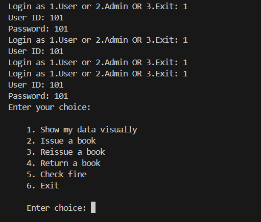
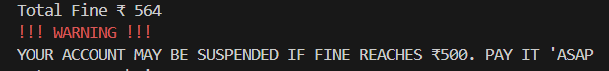
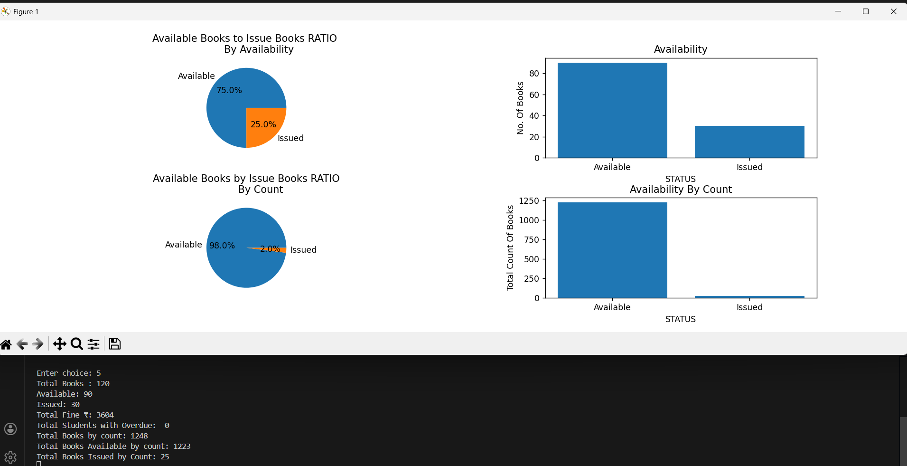

# Library Management System (Python)

A console-based Library Management System built using:
- NumPy
- Pandas
- Matplotlib

## Features
- User & Admin login
- Book issue, return, reissue
- Fine calculation
- Overdue user handling with admin confirmation
- Data persistence using Excel files

## Files Used
- library_books.xlsx
- User_data.xlsx
- Admin_data.xlsx
- removed_user.xlsx

## Screenshots
### Login Menu

### Overdue Confirmation

### Fine Warning

### Admin Statistics

## How to Run
1. Install dependencies
2. Run main Python file
